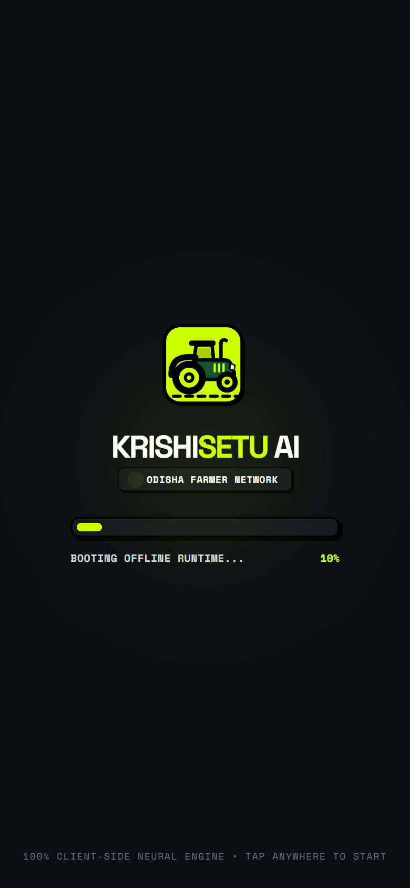
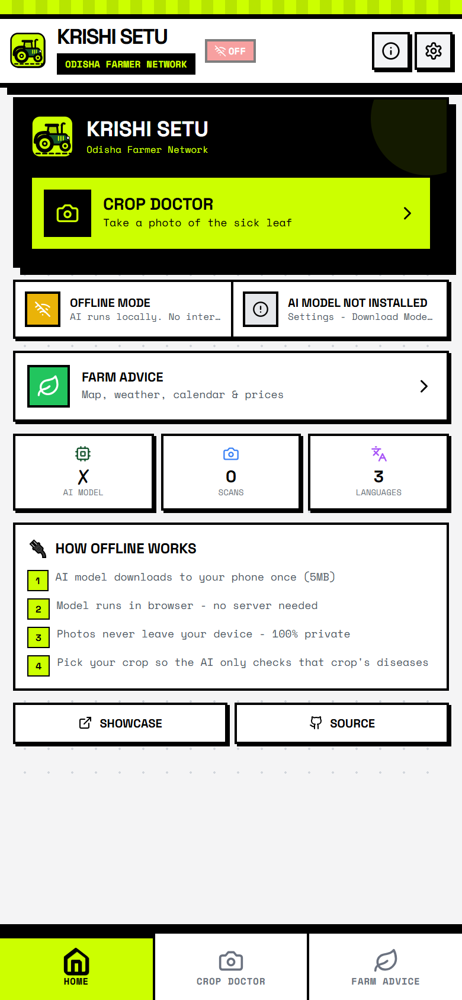
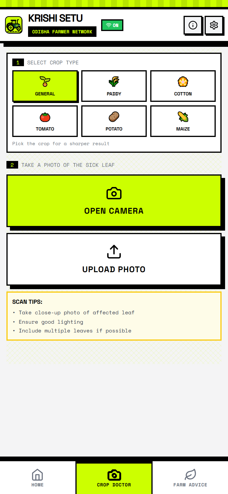
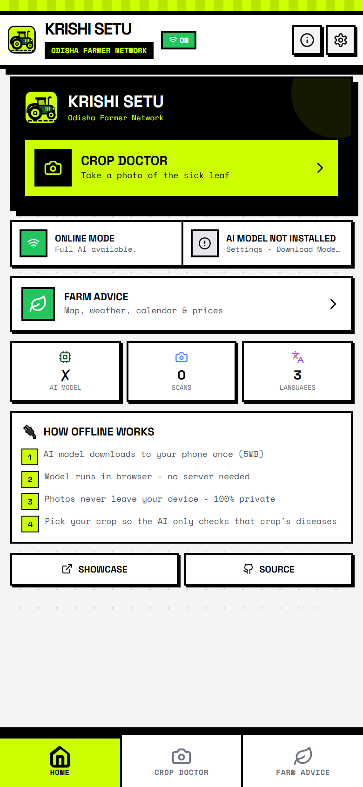
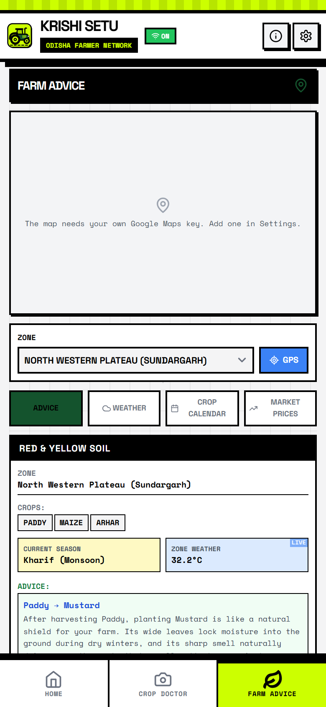
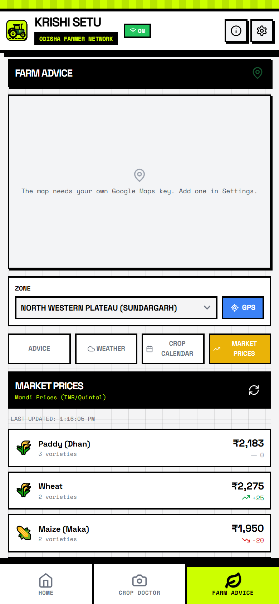
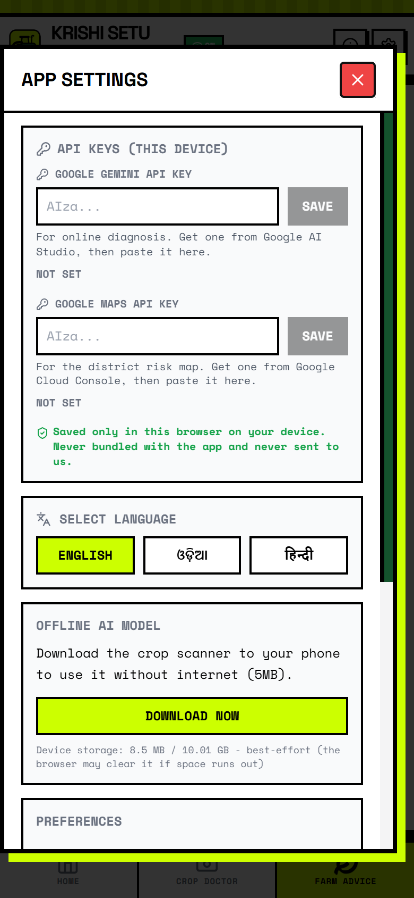

<div align="center">
  
  <br/><br/>
  <h1>🌾 KrishiSetu AI</h1>
  <p><strong>100% Offline AI Crop Pathologist & Regenerative Agronomy Grid</strong></p>
  
  <!-- Row 1: Hackathon, Track & Regional Focus -->
  <p>
    <a href="https://hack2skill.com/event/codeforcommunities2"></a>
    <a href="https://hack2skill.com/event/codeforcommunities2"></a>
    <a href="https://hack2skill.com/event/codeforcommunities2"></a>
    <a href="https://hack2skill.com/event/codeforcommunities2"></a>
    
  </p>

  <!-- Row 2: Live Deployments & Companion Repositories -->
  <p>
    <a href="https://krishi-setu-ai-seven.vercel.app/"></a>
    <a href="https://sahooshuvranshu.is-a.dev/KrishiSetu-AI/"></a>
    <a href="https://github.com/Crystal-Studio-Labs/KrishiSetu-ML-Model"></a>
    <a href="documentation/Readme.md"></a>
  </p>

  <!-- Row 3: Edge AI, Vision & Multimodal Intelligence -->
  <p>
    <a href="documentation/Document.md#11-the-offline-ml-engine"></a>
    
    
    
    
  </p>

  <!-- Row 4: Core Web Platform & Storage Technologies -->
  <p>
    
    
    
    
    
    
  </p>

  <!-- Row 5: Multilingual Voice & Agricultural Data Grid -->
  <p>
    
    
    
    
    
  </p>

  <!-- Row 6: Governance, Security & Quality Standards -->
  <p>
    <a href="LICENSE"></a>
    <a href="CONTRIBUTING.md"></a>
    <a href="CODE_OF_CONDUCT.md"></a>
    <a href="SECURITY.md"></a>
    
    
  </p>
</div>

<div align="center">
  
</div>

<br/>

## 📑 Table of Contents
- [🌾 The Crisis: Problem Statement 4](#-the-crisis-problem-statement-4-theme-cooperation)
- [⚡ The Solution: Krishi Setu](#-the-solution-krishi-setu)
- [📱 Mobile App Experience & Feature Gallery](#-mobile-app-experience--feature-gallery)
- [🧠 Machine Learning Architecture](#-machine-learning-architecture)
- [🛠️ System Architecture & Tech Stack](#️-system-architecture--tech-stack)
- [📂 File Structure](#-file-structure)
- [📖 Documentation Hub](#-documentation-hub)
- [🚀 Quick Start (Local Development)](#-quick-start-local-development)
- [☁️ One-Click Deployment](#️-one-click-deployment)
- [📚 ML Integration Guide](#-machine-learning-integration-guide)
- [🤝 Contributing & Security](#-contributing)
- [🌟 Star History](#-star-history)

---

## 🌾 The Crisis: Problem Statement 4 (Theme: Cooperation)

Small and marginal farmers across India lack access to data-driven agricultural guidance. Relying on traditional methods instead of satellite data, soil health analytics, and climate forecasting leads to crop failure and threatens food security. The absence of shared digital infrastructure also blocks cross-state collaboration on climate-resilient farming.

### 🚜 The Challenge
Build an interoperable digital agriculture network that delivers real-time, localised agro-advisories using AI. It should offer regenerative crop recommendations based on satellite data, soil health, and weather forecasting, plus a diagnostic tool for crop diseases, and be designed as a scalable digital public good enabling Indian states to share agricultural data models and strengthen cooperation on sustainable food production.

---

## ⚡ The Solution: Krishi Setu

**Krishi Setu** (Agriculture Bridge) is a heavy-duty, offline-first digital public good built to bridge the connectivity gap for Indian farmers. Utilizing industrial-grade Progressive Web App (PWA) architecture and Edge AI, it delivers state-of-the-art agricultural guidance directly to the farmer's pocket—even in the deepest rural fields with **zero internet connection**.

### 🌟 Key Features

* **100% Offline AI Disease Scanning:** Uses highly quantized MobileNet/TensorFlow.js models stored in the device's own private storage (OPFS) to scan and diagnose leaf diseases directly on the device's CPU/GPU. No cloud needed. No latency.
* **Generative Agronomy Engine:** Integrates Google's Gemini Flash to translate complex chemical and organic treatments into easy-to-understand native dialects.
* **Native Tongue & TTS Support:** Built-in localization for **Hindi** and **Odia (`ଓଡ଼ିଆ`)** with Web Speech API integration to read remedies out loud for farmers facing literacy barriers.
* **District Risk Map:** Interactive view of district-level pest and disease risk across all 30 districts of Odisha, positioned in the Farm Advice tab.
* **Real-Time Mandi Rates:** Localized commodity market prices across major trading hubs in Odisha (Bhubaneswar, Cuttack, Sambalpur, Berhampur).
* **PWA with Offline Support:** vite-plugin-pwa with Workbox for automatic caching of all assets and model weights.
* **IndexedDB Image Storage:** No size limits for storing scan images on the device.
* **Agri-Brutalism UX:** Designed strictly for outdoor mobile usability. Massive high-contrast buttons, thick borders, and heavy typography ensure readability under blinding sunlight.

---

## 📱 Mobile App Experience & Feature Gallery

KrishiSetu AI is engineered mobile-first for smallholder farmers using affordable smartphones in rural Odisha:

| 1. Animated Splash Screen | 2. Home Dashboard (Top) | 3. 100% Offline Readiness |
| :---: | :---: | :---: |
|  |  |  |
| *Vector tractor boot animation & telemetry* | *Clean header & instant scan trigger* | *Zero-cloud OPFS offline readiness* |

| 4. Crop Doctor Scanner | 5. Native Odia (ଓଡ଼ିଆ) UI | 6. District Disease Radar |
| :---: | :---: | :---: |
|  |  |  |
| *MobileNetV2 5-crop vision selector* | *Full native Odia localization* | *Interactive 30-district risk radar* |

| 7. Mandi Commodity Rates | 8. Weather & Humidity Alert | 9. Settings & Storage Gauges |
| :---: | :---: | :---: |
|  |  |  |
| *Live APMC commodity price feeds* | *Real-time fungal spore risk warnings* | *OPFS model storage & telemetry* |

---

## 🧠 Machine Learning Architecture

Krishi Setu brings state-of-the-art computer vision directly to the edge. Instead of relying on cloud APIs which inevitably fail in low-connectivity rural areas, the entire diagnostic pipeline runs locally on the farmer's smartphone.

### 1. The Model (MobileNetV2 & Transfer Learning)
We utilize a highly optimized **MobileNetV2** architecture fine-tuned via Transfer Learning. MobileNet was chosen specifically for its lightweight footprint and high accuracy on low-end mobile devices. The model is trained to classify 28 agricultural disease classes across Paddy, Cotton, Tomato, Potato, and Maize, plus negative non-leaf classes.

### 2. Edge Inference via TensorFlow.js
The trained Keras/TensorFlow model is quantized and converted into TensorFlow.js format (`model.json` and `.bin` weight shards). 
- **Zero-Latency:** Inference executes in real-time (~120ms) utilizing the smartphone's CPU or WebGL hardware acceleration.
- **Privacy-Preserving:** Photos taken by the farmer never leave their device.
- **Offline Execution:** The model weights live in the browser's Origin Private File System (OPFS), surviving device reboots and cache purges.

---

## 🛠️ System Architecture & Tech Stack

1. **Frontend Core:** React 18 + Vite Single Page Application.
2. **Offline Caching:** Vite-PWA with Workbox for complete offline precaching.
3. **Edge ML:** `@tensorflow/tfjs` static bundling to avoid dynamic import failures offline.
4. **LLM Engine:** `@google/genai` (Gemini Flash for multimodal cloud reasoning when online).
5. **Voice:** Web Speech API for spoken remedies in Odia, Hindi, and English — zero API cost, works offline.
6. **Translation:** Bundled trilingual dictionary (`src/i18n/translations.js`) — no network needed.
7. **Geospatial:** Google Maps Platform for the district disease-risk map.
8. **Styling:** Custom "Agri-Brutalism" design system with TailwindCSS.

---

## 📂 File Structure

```text
KrishiSetu-AI/
├── api/                       # Vercel Serverless Functions (Mandi market proxy)
│   └── mandi.js
├── documentation/             # Project technical manual, presentation decks, scripts, and screenshots
│   ├── Document.md            # Comprehensive technical architecture & compliance manual
│   ├── Phases.md              # Project phases & milestone tracking
│   ├── Ppt.md & Ppt.txt       # Pitch deck specifications (for Google Slides AI / Gamma)
│   ├── Readme.md              # Documentation navigation hub
│   ├── Script.md & Script.txt # Official demo video narration scripts (90s / 60s)
│   ├── Todo.md                # Audited checklist of verified fixes
│   └── screenshots/           # Mobile portrait screenshot gallery (390x844 DPR=2)
├── docs/                      # GitHub Pages static landing site
├── public/                    # PWA Manifest, Service Worker, and ML Model binaries
│   └── model/                 # Quantized TFJS model files (model.json, .bin shards, classes.json)
├── src/                       # React Frontend Source Code
│   ├── components/            # UI components and screen views
│   │   ├── ui/                # Reusable UI elements (Navbar, Map, Splash, Logo, Toast)
│   │   ├── views/             # Full tab screens (HomeTab, CameraScan, SoilAdvisory, etc.)
│   │   └── index.js           # Central component registry
│   ├── config/                # Centralized constants (ODISHA_CENTER, quality gates)
│   ├── context/               # Global React context state (AppContext)
│   ├── data/                  # Offline disease dictionary (offline_diseases.json)
│   ├── i18n/                  # Localized dictionaries & telemetry data
│   ├── services/              # Core Logic (Gemini, TFJS loader, OPFS storage, offline diagnosis)
│   ├── App.jsx                # Main Application Routing & State
│   ├── index.css              # Agri-Brutalism Tailwind styling
│   └── main.jsx               # Entry point with PWA registration
├── .env.example               # Required API keys template
├── index.html                 # Main Entry Point
├── tailwind.config.js         # Custom theme configuration
├── vercel.json                # Vercel deployment configuration
└── vite.config.js             # Vite build settings with PWA plugin
```

---

## 📖 Documentation Hub

Explore the full engineering manual, milestone tracking, pitch decks, and narration scripts:

<div align="center">

[](documentation/Readme.md)
[](documentation/Document.md)
[](documentation/ModelTraining.md)
[](documentation/Phases.md)
[](documentation/Ppt.md)
[](documentation/Script.md)

</div>

| Resource | Format | Description | Target Audience |
| :--- | :---: | :--- | :--- |
| [**Document.md**](documentation/Document.md) | `Markdown` | Complete engineering architecture, OPFS storage, TF.js pipeline, and Google AI compliance. | All Contributors, Judges, Developers |
| [**ModelTraining.md**](documentation/ModelTraining.md) | `Markdown` | Machine learning training guide, Colab T4 pipeline, TF.js export, and OPFS integration contract. | ML Engineers, Agronomists |
| [**Phases.md**](documentation/Phases.md) | `Markdown` | 11-phase milestone progress tracker, quality gates, and verified architectural fixes. | Project Leads, Maintainers |
| [**Ppt.md**](documentation/Ppt.md) & [**Ppt.txt**](documentation/Ppt.txt) | `Deck / Text` | High-contrast 10-slide pitch presentation with speaker notes and Google Slides AI prompt. | Presenters, Product Leads |
| [**Script.md**](documentation/Script.md) & [**Script.txt**](documentation/Script.txt) | `Script / Text` | Official 90s walkthrough and 60s lightning pitch voiceover scripts with visual cues. | Presenters, Video Creators |
| [**Todo.md**](documentation/Todo.md) | `Markdown` | Audited checklist of verified fixes and launch polish items. | Core Developers |
| [**Screenshots/**](documentation/screenshots/) | `Gallery` | 10 high-resolution smartphone-ratio feature captures (390x844 DPR=2). | Designers, Presenters |

👉 *Visit the dedicated [**Documentation Hub (documentation/Readme.md)**](documentation/Readme.md) for full context, persona pathways, and architectural diagrams.*

---

## 🚀 Quick Start (Local Development)

To run Krishi Setu locally on your machine:

```bash
# 1. Clone the repository
git clone https://github.com/SahooShuvranshu/KrishiSetu-AI.git
cd KrishiSetu-AI

# 2. Install dependencies
npm install

# 3. (Optional) Configure API keys
# The app ships ready for offline use. Users can add their own
# optional Gemini and Google Maps keys in Settings > API KEYS.

# 4. Start the development server
npm run dev
```

---

## ☁️ One-Click Deployment

Deploy your own instance of Krishi Setu instantly:

[](https://vercel.com/new/clone?repository-url=https://github.com/SahooShuvranshu/KrishiSetu-AI) [](https://app.netlify.com/start/deploy?repository=https://github.com/SahooShuvranshu/KrishiSetu-AI) [](https://render.com/deploy?repo=https://github.com/SahooShuvranshu/KrishiSetu-AI)

---

## 🧠 Machine Learning Integration & Training Guide

<div align="left">

[](https://github.com/Crystal-Studio-Labs/KrishiSetu-ML-Model)
[](https://colab.research.google.com/github/Crystal-Studio-Labs/KrishiSetu-ML-Model/blob/main/notebooks/KrishiSetu_Model_Training.ipynb)
[](documentation/ModelTraining.md)

</div>

To train, fine-tune, or quantize custom crop disease vision models for the offline edge engine, use our companion repository and detailed engineering manual:
👉 **Companion Repository**: [**Crystal-Studio-Labs/KrishiSetu-ML-Model**](https://github.com/Crystal-Studio-Labs/KrishiSetu-ML-Model)  
👉 **Engineering Guide**: [**Machine Learning Integration & Training Guide (documentation/ModelTraining.md)**](documentation/ModelTraining.md)

1. **Launch in Colab**: Open [`KrishiSetu_Model_Training.ipynb`](https://colab.research.google.com/github/Crystal-Studio-Labs/KrishiSetu-ML-Model/blob/main/notebooks/KrishiSetu_Model_Training.ipynb) on Google Colab with NVIDIA T4 GPU acceleration.
2. **Dataset & Augmentation**: Train on Odisha crop disease datasets (Paddy, Cotton, Tomato, Potato, Sugarcane) plus the `Other_NotALeaf` negative guard class.
3. **MobileNetV2 Transfer Learning**: Fine-tune top layers with in-graph `Rescaling(scale=2.0, offset=-1.0)` normalization.
4. **Contract Verification**: Run Step 9 automated assertions ensuring input shape `(224, 224, 3)` and class ordering match the frontend contract.
5. **TensorFlow.js Sharded Export**: Quantize with Float16 and export `model.json` + `.bin` weight shards directly into `public/model/`.

---

## 🤝 Contributing & Community Standards

<div align="left">

[](CONTRIBUTING.md)
[](CODE_OF_CONDUCT.md)
[](SECURITY.md)
[](mailto:contact@sahooshuvranshu.is-a.dev)

</div>

KrishiSetu AI is an open-source Digital Public Good. We welcome contributions from developers, agronomists, ML researchers, and translators across India and the globe:
- Please read our [**Contributing Guidelines (CONTRIBUTING.md)**](CONTRIBUTING.md) for local environment setup, architecture guardrails, and pull request procedures.
- We strictly uphold our [**Code of Conduct (CODE_OF_CONDUCT.md)**](CODE_OF_CONDUCT.md) to ensure an inclusive, respectful, and harassment-free community.

## 🔒 Security & Vulnerability Reporting

We treat the security of our offline models and data pipelines with the highest priority:
- If you discover a security vulnerability, please review our [**Security Policy (SECURITY.md)**](SECURITY.md).
- To disclose responsibly, please email our lead security maintainer directly at: **[contact@sahooshuvranshu.is-a.dev](mailto:contact@sahooshuvranshu.is-a.dev)**.
- We acknowledge all vulnerability reports within **24–48 hours**. Please do **not** file public GitHub issues for security vulnerabilities.

---

## 🌟 Star History

<div align="center">
  <a href="https://star-history.com/#SahooShuvranshu/KrishiSetu-AI&Date">
    <picture>
      <source media="(prefers-color-scheme: dark)" srcset="https://api.star-history.com/svg?repos=SahooShuvranshu/KrishiSetu-AI&type=Date&theme=dark" />
      <source media="(prefers-color-scheme: light)" srcset="https://api.star-history.com/svg?repos=SahooShuvranshu/KrishiSetu-AI&type=Date" />
      
    </picture>
  </a>
</div>

---

## 📄 License

<div align="left">
  <a href="LICENSE">
    
  </a>
</div>

This project is licensed under the **MIT License** — see the [LICENSE](LICENSE) file for details.

---

<div align="center">
  <p>Built with 💡 by <b>Crystal Studio Labs</b></p>
  <p><sub>Shuvransu Sekhar Sahoo • Snehal Kumar Moharana • Subhankar Mohapatra • Pruthiraj Lenka</sub></p>
</div>
