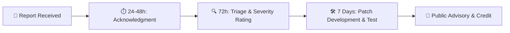

# 🛡️ Security Policy & Responsible Disclosure

 

**Safeguarding Farmer Privacy, Model Integrity, and Edge Agronomy Systems**

---

## 🌾 1. Security Philosophy & Public Good Imperative

At **Crystal Studio Labs**, we treat the security and data privacy of **KrishiSetu AI** with utmost seriousness. 

Because KrishiSetu is engineered as a **Digital Public Good (DPG)** for smallholder farmers who depend on accurate crop disease diagnostics and safety dosages, a compromised model or malicious vulnerability directly threatens rural livelihoods and crop yields. 

Our core security architecture is governed by three non-negotiable principles:
1. **Privacy by Default**: Agricultural photos, field location coordinates, and diagnostic logs belong solely to the farmer and are processed client-side.
2. **Zero Inlined Secrets**: The project codebase and public production bundles contain zero private API keys, backend secrets, or cloud tokens.
3. **Sandbox Resilience**: Model binaries and offline remedy dictionaries are isolated within the browser's protected origin boundaries.

---

## 📌 2. Supported Versions

We actively monitor, patch, and deploy security updates to the following release branches:

| Version Branch | Release Status | Security Maintenance |
| :--- | :---: | :--- |
| **`v1.x.x` (Main / Production)** | 🟢 Active | Fully supported with continuous vulnerability remediation and edge patches. |
| **`v0.x.x` (Alpha / Experimental)** | 🔴 Deprecated | Unsupported. Users and developers must upgrade immediately to `v1.x.x`. |

---

## 🧱 3. Threat Model & Architectural Defenses

KrishiSetu AI employs defense-in-depth across the web platform, client storage, and serverless proxies:

### 1. Client-Side Edge Isolation
* **Zero Telemetry**: All TensorFlow.js vision models execute locally on the smartphone's WebGL or CPU hardware. Photos captured via the camera do not transit external servers.
* **IndexedDB Storage**: Scanned images reside inside the browser's dedicated IndexedDB storage partition (`src/services/imageStorage.js`), inaccessible to third-party domains.

### 2. Sandbox Storage Integrity (OPFS)
* **Origin Private File System**: Neural network weight shards (`model.json`, `.bin` files) are saved inside the browser's Origin Private File System (`src/services/storageService.js`), shielded from external file system tampering or cross-origin access.

### 3. Client API Key Obfuscation & Isolation
* **No Keys in Bundles**: Unlike typical web apps that bundle sensitive API credentials via `VITE_` variables into public assets, KrishiSetu reads no cloud credentials from build-time environment files.
* **User-Owned Keys**: Optional Gemini Flash and Google Maps keys are entered solely by the user on their own device via **Settings → API KEYS (THIS DEVICE)**. Keys remain in local device storage and are never uploaded or aggregated.

### 4. HTTP Security Headers
The production deployment enforces strict HTTP security headers via `vercel.json`:
* `X-Content-Type-Options: nosniff`: Prevents MIME-type confusion attacks.
* `X-Frame-Options: DENY`: Prevents clickjacking attacks.
* `X-XSS-Protection: 1; mode=block`: Mitigates cross-site scripting vulnerabilities.
* `Referrer-Policy: strict-origin-when-cross-origin`: Restricts credential and referrer leaks.

---

## 🚨 4. Reporting a Vulnerability

If you discover a potential security vulnerability within KrishiSetu AI, its client-side machine learning pipeline, or its proxy endpoints, **please do not disclose it publicly or file a public GitHub issue**.

### How to Report Privately
Please submit an encrypted or detailed vulnerability advisory directly to the lead maintainer:

### 📧 Dedicated Security Email:  
### [**contact@sahooshuvranshu.is-a.dev**](mailto:contact@sahooshuvranshu.is-a.dev)

### What to Include in Your Report
To accelerate investigation and triage, please provide:
1. **Type of Vulnerability**: (e.g., XSS, OPFS file overwrite, API key leakage, proxy bypass, denial of service).
2. **Affected Component**: Source file, route, or service impacted (e.g., `src/services/modelStorageService.js`, `api/mandi.js`).
3. **Step-by-Step Reproduction**: Detailed reproduction steps, sample payloads, or scripts demonstrating the issue.
4. **Impact Assessment**: Explanation of how the vulnerability could be exploited against farmers, devices, or data integrity.
5. **Proposed Remediation**: Any code changes or configuration fixes you recommend.

---

## ⏱️ 5. Vulnerability Response Timeline & SLA

We are committed to rapid, transparent, and collaborative resolution:

* **Initial Acknowledgment**: Within **24 to 48 hours**, you will receive a personal confirmation that your report was received.
* **Triage & Assessment**: Within **72 hours**, maintainers will validate the report, reproduce the finding, and assign a severity rating (Low, Medium, High, Critical).
* **Remediation & Patch**: We target a maximum resolution window of **7 to 14 business days** depending on complexity.
* **Coordinated Disclosure**: Once the fix is deployed and verified, a public security advisory will be published, providing full attribution to the researcher.

---

## 🛡️ 6. Safe Harbor Policy

We consider ethical security research conducted within the bounds of this policy to be authorized and protected:

* If you make a good-faith effort to avoid privacy violations, data destruction, and service degradation during your research, **we will not pursue legal action against you**.
* We ask that you give us a reasonable period of time to resolve the issue before disclosing any information publicly.
* Do not attempt to access, modify, or destroy user data or flood live production infrastructure with automated denial-of-service traffic.

---

## 🏆 7. Recognition & Hall of Fame

While we do not currently operate a paid commercial bug bounty, we deeply value the contributions of ethical security researchers:
- Researchers who responsibly disclose valid, actionable vulnerabilities will be permanently credited in our release notes and GitHub Security Hall of Fame.
- We will gladly provide formal reference letters and endorsements for researchers assisting in safeguarding this digital public good.

---

  KrishiSetu AI Security Team • Crystal Studio Labs 
  For inquiries: <a href="mailto:contact@sahooshuvranshu.is-a.dev">contact@sahooshuvranshu.is-a.dev</a>

