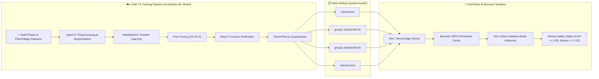

# 🧠 KrishiSetu AI — Machine Learning Integration & Training Guide

<div align="center">

[](https://github.com/Crystal-Studio-Labs/KrishiSetu-ML-Model)
[](https://colab.research.google.com/github/Crystal-Studio-Labs/KrishiSetu-ML-Model/blob/main/notebooks/KrishiSetu_Model_Training.ipynb)
[](ModelTraining.md#2-neural-architecture--preprocessing-contract)
[](ModelTraining.md#5-tfjs-conversion--weight-sharding)
[](ModelTraining.md#6-client-side-engine--opfs-integration)

<p>
  <strong>Complete Engineering Manual</strong> for training, quantizing, verifying, and deploying on-device agricultural disease vision models for KrishiSetu AI.
</p>

</div>

> [!NOTE]
> **Standalone Model Repository**: All training pipelines, transfer learning notebooks, dataset loaders, and test contract harnesses are maintained in our dedicated companion repository:  
> 👉 [**github.com/Crystal-Studio-Labs/KrishiSetu-ML-Model**](https://github.com/Crystal-Studio-Labs/KrishiSetu-ML-Model)

---

## 1. Pipeline Overview & Topology

KrishiSetu AI decouples model training from edge inference. Training takes place in a cloud GPU environment (Google Colab with NVIDIA T4 GPU), exporting a quantized, web-friendly TensorFlow.js Layers model. The browser executes this model 100% locally on the device using WebGL acceleration and the Origin Private File System (OPFS).



---

## 2. Neural Architecture & Preprocessing Contract

To ensure 100% compatibility between the trained Python/Keras graph and the client-side JavaScript engine, models must strictly follow this architectural contract:

### 2.1 Input Geometry & Internal Rescaling
- **Input Shape**: `(224, 224, 3)` RGB images.
- **Client Canvas Feed**: The client JavaScript engine crops the center of the camera frame, resizes it to `224x224`, normalizes pixel values to `[0.0, 1.0]`, and feeds a 4D tensor `[1, 224, 224, 3]`.
- **In-Graph Rescaling Layer**: The first layer in the Keras model **must** be a `Rescaling` layer:
  ```python
  keras.layers.Rescaling(scale=2.0, offset=-1.0, input_shape=(224, 224, 3))
  ```
  This automatically transforms the client's `[0, 1]` tensor to the `[-1, 1]` range expected by MobileNetV2 without requiring extra client-side normalization logic.

### 2.2 Backbone & Classification Head
```python
import tensorflow as tf
from tensorflow import keras

# 1. Base Feature Extractor (MobileNetV2 with width multiplier alpha=0.35 for low memory)
base_model = keras.applications.MobileNetV2(
    input_shape=(224, 224, 3),
    include_top=False,
    weights='imagenet',
    alpha=0.35  # Lightweight footprint (~4.8MB total)
)

# 2. Build Model with in-graph normalization
inputs = keras.Input(shape=(224, 224, 3), name="input_layer")
x = keras.layers.Rescaling(scale=2.0, offset=-1.0, name="rescaling")(inputs)
x = base_model(x, training=False)
x = keras.layers.GlobalAveragePooling2D(name="avg_pool")(x)
x = keras.layers.Dropout(0.25, name="dropout")(x)
outputs = keras.layers.Dense(NUM_CLASSES, activation="softmax", name="predictions")(x)

model = keras.Model(inputs=inputs, outputs=outputs, name="krishisetu_mobilenetv2")
```

---

## 3. Dataset Classes & Odisha Focus

The classification model covers Odisha's key staple and cash crops alongside an essential negative class:

| Crop Category | Supported Diseases & Conditions | Class Identifier |
| :--- | :--- | :--- |
| **🌾 Rice / Paddy** | Bacterial Leaf Blight, Blast, Brown Spot, Healthy | `Rice_Bacterial_Blight`, `Rice_Blast`, `Rice_Brown_Spot`, `Rice_Healthy` |
| **🌱 Cotton** | Bacterial Blight, Curl Virus, Healthy | `Cotton_Bacterial_Blight`, `Cotton_Curl_Virus`, `Cotton_Healthy` |
| **🍅 Tomato** | Early Blight, Late Blight, Leaf Mold, Septoria, Healthy | `Tomato_Early_Blight`, `Tomato_Late_Blight`, `Tomato_Leaf_Mold`, `Tomato_Healthy` |
| **🥔 Potato** | Early Blight, Late Blight, Healthy | `Potato_Early_Blight`, `Potato_Late_Blight`, `Potato_Healthy` |
| **🎋 Sugarcane** | Red Rot, Healthy | `Sugarcane_Red_Rot`, `Sugarcane_Healthy` |
| **🛡️ Guard Class** | Soil, Hands, Sky, Non-Plant Background | `Other_NotALeaf` |

> [!IMPORTANT]
> **The `Other_NotALeaf` Negative Class**:  
> In real farm fields, farmers often hold leaves in their hands or point cameras at soil. Training with non-leaf negative samples prevents spurious disease predictions on bare hands or soil.

---

## 4. Training in Google Colab (Step-by-Step)

The complete end-to-end training notebook is hosted at:  
👉 [`KrishiSetu-ML-Model/notebooks/KrishiSetu_Model_Training.ipynb`](https://github.com/Crystal-Studio-Labs/KrishiSetu-ML-Model/blob/main/notebooks/KrishiSetu_Model_Training.ipynb)

### Step 1: Launch Notebook
1. Navigate to [`Crystal-Studio-Labs/KrishiSetu-ML-Model`](https://github.com/Crystal-Studio-Labs/KrishiSetu-ML-Model).
2. Click **Open in Colab** on the top badge.
3. In Colab, select **Runtime → Change runtime type → T4 GPU**.

### Step 2: Data Augmentation
To survive varying field sunlight and handheld smartphone camera shake, augment training images:
```python
data_augmentation = keras.Sequential([
    keras.layers.RandomFlip("horizontal_and_vertical"),
    keras.layers.RandomRotation(0.15),
    keras.layers.RandomZoom(0.15),
    keras.layers.RandomContrast(0.1),
])
```

### Step 3: Two-Phase Training
1. **Phase 1 (Feature Extraction)**: Freeze the MobileNetV2 base model. Train only the dense head for 10 epochs using Adam (`lr=1e-3`).
2. **Phase 2 (Fine-Tuning)**: Unfreeze the top 30 layers of the base model. Train with a very low learning rate (`lr=1e-5`) for 15 epochs with early stopping (`patience=3`).

### Step 4: Step 9 Automated Contract Check
Before exporting to TF.js, run Step 9 in the notebook to assert compliance:
```python
# Step 9 Verification Assertion
assert model.input_shape == (None, 224, 224, 3), "Invalid input shape"
assert isinstance(model.layers[1], keras.layers.Rescaling), "Missing in-graph Rescaling layer"
assert model.output_shape == (None, len(class_names)), "Output dimension mismatch with classes"
print("✅ Step 9 Contract Verification: PASSED")
```

---

## 5. TF.js Conversion & Weight Sharding

Export the trained Keras model into TensorFlow.js Layers format with Float16 weight quantization:

```bash
# Install tensorflowjs
pip install tensorflowjs

# Convert Keras model to TFJS layers with float16 quantization
tensorflowjs_converter \
    --input_format=tf_saved_model \
    --output_format=tfjs_layers_model \
    --quantize_float16=* \
    --weight_shard_size_bytes=4194304 \
    saved_model/ \
    tfjs_model/
```

### Artifact Manifest
The export produces:
1. `model.json`: Model topology and weight manifest.
2. `group1-shard1of2.bin`: Quantized binary weight shard (~4.0 MB).
3. `group1-shard2of2.bin`: Quantized binary weight shard (~650 KB).
4. `classes.json`: Array of class names matching the softmax output order.
5. `metadata.json`: Timestamp, validation accuracy, and training parameters.

---

## 6. Client-Side Engine & OPFS Integration

KrishiSetu AI executes the model directly inside the user's browser:

### 6.1 Placement in KrishiSetu-AI
Copy the generated files from the ML repo into KrishiSetu AI:
```bash
# In KrishiSetu-AI root directory:
cp -r /path/to/tfjs_model/* public/model/
```

### 6.2 Dual-Tier Storage Architecture
1. **HTTP Shell Fallback (`public/model/`)**: Ships with the application deployment. Loaded initially when the device has internet access.
2. **Origin Private File System (`OPFS`)**: When the farmer taps **Settings → Download Offline Model**, `src/services/modelStorageService.js` downloads the shards directly into the browser's OPFS sandbox. OPFS is immune to browser cache eviction and works seamlessly in airplane mode.

### 6.3 Clinical Safety Gates
Predictions are evaluated in `src/services/offlineDiagnosis.js` through two safety barriers:
```javascript
// Strict safety gates to prevent hazardous pesticide recommendations
const MIN_CONFIDENCE = 0.50; // Minimum 50% top probability
const MIN_MARGIN = 0.12;     // Top prediction must exceed runner-up by 12%

if (topPrediction.probability < MIN_CONFIDENCE || margin < MIN_MARGIN) {
  return {
    status: 'UNCERTAIN',
    message: 'Image confidence too low. Please retake photo with better lighting.',
    prediction: null
  };
}
```

---

## 7. How to Ship Retrained Models to Production

1. **Retrain & Export**: Run the notebook in [`Crystal-Studio-Labs/KrishiSetu-ML-Model`](https://github.com/Crystal-Studio-Labs/KrishiSetu-ML-Model).
2. **Replace Files**: Overwrite `public/model/model.json`, `public/model/*.bin`, and `public/model/classes.json`.
3. **Verify Build**:
   ```bash
   npm run build
   ```
4. **Commit & Push**:
   ```bash
   git add public/model/
   git commit -m "feat(ml): update quantized crop disease model weights"
   git push origin main
   ```
5. **Redeploy**: Vercel automatically deploys the new static model shards. Existing users will receive the update when they next connect to the network.

---

<div align="center">
  <sub>KrishiSetu AI ML Engine • Maintained by <a href="https://github.com/Crystal-Studio-Labs">Crystal Studio Labs</a></sub>
</div>
