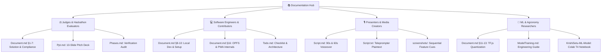

# 📚 KrishiSetu AI — Documentation Hub

<div align="center">

[](https://googleai.devpost.com/)
[](https://googleai.devpost.com/)
[](https://googleai.devpost.com/)
[](https://googleai.devpost.com/)
[](Document.md#11-the-offline-ml-engine)
[](Document.md#key-features)
[](Document.md#16-pwa--offline-notes)
[](Document.md#odisha-crop-focus)
[](../LICENSE)

<br/>

**The central engineering, architectural, and presentation nexus for KrishiSetu AI**  
*100% Client-Side Crop Disease Diagnosis & Multilingual Agro-Advisory Grid*

[🌾 Live PWA Application](https://krishi-setu-ai-seven.vercel.app/) • [🌐 Static Showcase Page](https://sahooshuvranshu.is-a.dev/KrishiSetu-AI/) • [🧠 Standalone ML Repo](https://github.com/Crystal-Studio-Labs/KrishiSetu-ML-Model)

</div>

---

## 🌍 Executive & Operational Context

> [!IMPORTANT]
> **The Real-World Crisis (Problem Statement 4: Cooperation)**  
> Smallholder farmers in Odisha and across rural India lose up to **40% of their annual crop yields** to preventable plant pathogens. Over **85% of agricultural fields operate in cellular dead zones** where cloud-only agritech tools completely fail. With an extension deficit of **1 government agronomist per 1,500+ farming families**, remote farmers rely on informal pesticide dealers who often prescribe wrong chemical treatments, creating crippling debt cycles and soil degradation.

### 🚜 How KrishiSetu AI Solves This
KrishiSetu ("The Farmer's Bridge") is an open-source **Digital Public Good (DPG)** engineered from the ground up for low-resource environments:
1. **Zero-Connectivity Diagnosis**: Operates 100% client-side in the browser using quantized **MobileNetV2** models running on **TensorFlow.js**, achieving sub-150ms inference in airplane mode.
2. **Persistent Sandbox Storage (OPFS)**: Model weights are stored in the browser's **Origin Private File System**, making them immune to cache purges and persistent across reboots.
3. **Universal Literacy Access**: Integrates zero-cost browser **Web Speech API** synthesis to read organic and chemical remedies aloud in native **Odia (`ଓଡ଼ିଆ`)**, **Hindi (`हिन्दी`)**, and **English**.
4. **Cooperative Agronomy Grid**: Connects individual farm triage to an interactive **30-district disease risk radar**, seasonal planting calendars, weather alerts, and localized mandi commodity rates.

---

## 🧭 Persona-Based Reading Pathways

Choose the pathway tailored to your role:



| Pathway | Starting Document | Purpose & Context | Recommended Next Step |
| :--- | :--- | :--- | :--- |
| **⚖️ Hackathon Judges** | [Document.md](Document.md) | Architectural compliance, problem alignment, and Google AI integration verification | Review [Ppt.md](Ppt.md) & [Live Demo](https://krishi-setu-ai-seven.vercel.app/) |
| **💻 Core Engineers** | [Document.md](Document.md) | Complete local development setup, routing, state management, and OPFS engine | Inspect [Todo.md](Todo.md) & codebase |
| **🎙️ Presenters & Video** | [Script.md](Script.md) | Word-for-word voiceover script, visual timings, and companion screenshot mapping | Open [Ppt.txt](Ppt.txt) in Google Slides AI |
| **🔬 ML Researchers** | [ModelTraining.md](ModelTraining.md) | Colab T4 transfer learning pipeline, Step 9 contract assertions, and TFJS converter | Open [KrishiSetu-ML-Model](https://github.com/Crystal-Studio-Labs/KrishiSetu-ML-Model) |

---

## 📑 Complete Documentation Matrix

| Document | Format | Status | Primary Audience | Context & Description |
| :--- | :---: | :---: | :---: | :--- |
| [**Document.md**](Document.md) | `Markdown` |  | All / Judges / Devs | **Master Engineering & Architecture Manual**<br/>Covers system data flow, edge ML contracts, Google AI compliance, local setup, OPFS storage, and offline remedy dictionaries. |
| [**Phases.md**](Phases.md) | `Markdown` |  | Maintainers / Leads | **Project Phases & Progress Tracker**<br/>Chronological single source of truth tracking milestones, architectural corrections, quality gates, and verified bug resolutions. |
| [**Script.md**](Script.md) | `Markdown` |  | Video Creators / Leads | **Official Demo Video & Pitch Script**<br/>Scene-by-scene narration script with timestamped visual cues for Google Vids/Loom (90s full demo and 60s lightning pitch). |
| [**Script.txt**](Script.txt) | `Plaintext` |  | Presenters / Voiceover | **Plaintext Narration Script**<br/>Raw unformatted text file optimized for teleprompters, text-to-speech tools, and rapid voiceover recording. |
| [**Ppt.md**](Ppt.md) | `Markdown` |  | Product Leads / Judges | **Pitch Deck Specification (10 Slides)**<br/>Clean 16:9 minimalist pitch deck formatted with speaker notes and screenshot slot references for Gamma, Canva, or Marp. |
| [**Ppt.txt**](Ppt.txt) | `Plaintext` |  | Presenters / AI Tools | **Google Slides AI Master Prompt**<br/>Structured prompt and copy-paste ready blocks for Gemini in Google Slides, SlidesAI, MagicSlides, and Plus AI. |
| [**ModelTraining.md**](ModelTraining.md) | `Markdown` |  | ML Scientists / Devs | **Machine Learning Integration & Training Guide**<br/>Complete manual for dataset curation, OpenCV augmentation, MobileNetV2 transfer learning, Step 9 contract assertions, and OPFS integration. |
| [**Todo.md**](Todo.md) | `Markdown` |  | Core Developers | **Task Checklist & Verification Log**<br/>Audited task inventory documenting 30+ completed architectural fixes, dead code removal, and launch readiness items. |
| [**Screenshots/**](screenshots/) | `Gallery` |  | Designers / Evaluators | **Smartphone Screenshot Gallery (10 Shots)**<br/>Sequentially numbered 390x844 mobile captures (DPR=2) covering splash, scanner, Odia UI, radar map, mandi rates, and storage gauges. |
| [**KrishiSetu-ML-Model**](https://github.com/Crystal-Studio-Labs/KrishiSetu-ML-Model) | `Repository` |  | ML Scientists | **Standalone ML Training Repository**<br/>Colab T4 training notebook, MobileNetV2 fine-tuning code, dataset loaders, contract tests, and Keras-to-TFJS exporters. |

---

## 🏗️ Architecture & Storage Topology

```text
KrishiSetu-AI/
├── api/                       # Vercel Serverless Functions (Mandi market proxy with edge caching)
│   └── mandi.js
├── documentation/             # Engineering manuals, pitch decks, scripts & screenshots
│   ├── Document.md            # Comprehensive technical manual & API contract
│   ├── Phases.md              # Milestone tracking & verified fixes log
│   ├── Ppt.md & Ppt.txt       # Pitch deck specifications (Markdown & Google Slides AI prompt)
│   ├── Readme.md              # Documentation navigation hub (this file)
│   ├── Script.md & Script.txt # Demo video narration scripts (90s / 60s)
│   ├── Todo.md                # Task checklist & audit logs
│   └── screenshots/           # 10 mobile smartphone screenshot assets (390x844 DPR=2)
├── docs/                      # Static landing site hosted on GitHub Pages
├── public/                    # PWA Webmanifest, Service Worker & model binaries
│   └── model/                 # Quantized TFJS Layers model (model.json, .bin shards, classes.json)
└── src/                       # React 18 Single Page Application
    ├── components/
    │   ├── ui/                # Reusable UI primitives (Tractor Logo, StatusBadge, Map, FocusTrap)
    │   └── views/             # Full tab views (HomeTab, CameraScan, SoilAdvisory, Weather, Mandi)
    ├── config/                # Centralized constants, geometries & confidence thresholds
    ├── context/               # Global React context state (AppContext, ToastContext)
    ├── data/                  # Offline disease dictionary (offline_diseases.json)
    ├── i18n/                  # Multilingual dictionaries (translations.js, multilingual_data.js)
    └── services/              # TFJS loader, OPFS persistent storage, Gemini API, TTS engine
```

---

## 🔒 Security & On-Device Privacy Posture

> [!NOTE]
> - **Zero Server Telemetry**: Scanned crop leaves are processed strictly on the client device. Photos never leave the browser sandbox.
> - **On-Device API Key Storage**: Optional Google Gemini and Google Maps API keys are entered directly in the user's browser via **Settings → API KEYS (THIS DEVICE)**. Keys are never bundled at build time or committed to git.
> - **Persistent Origin Private File System (OPFS)**: Large ML model weights are downloaded directly into OPFS, avoiding HTTP cache eviction and ensuring offline reliability in rural fields.

---

<div align="center">
  <sub>KrishiSetu AI • Developed by Crystal Studio Labs for Google AI Hackathon 2026</sub>
</div>
